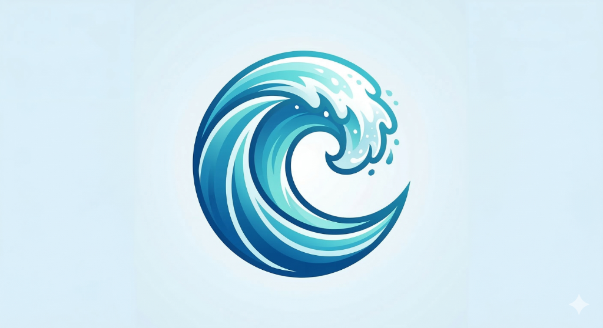

<div align="center">
  
  <h1>Swim.ai 🏊‍♂️✨</h1>
  <p><strong>Everything Delivered. Ernakulam.</strong></p>
  <p><i>A hyper-premium, AI-driven logistics and delivery platform built for scale.</i></p>
</div>

---

## 🚀 About Swim.ai

**Swim.ai** is a next-generation local delivery application designed exclusively for Ernakulam. It provides lightning-fast deliveries of food, groceries, medicine, and boutique retail products. By leveraging a premium glassmorphism dark-mode UI, real-time geographic tracking algorithms, and a native **Supabase** backend, Swim.ai delivers an unparalleled consumer experience.

Instead of generic grid layouts, Swim.ai focuses on a **highly aesthetic, sensory-rich** user interface featuring dynamic gradients, neon accents, and smooth micro-animations. 

---

## ⚡ Key Features

- **Hyper-Premium UI/UX**: State-of-the-art dark mode interface with glassmorphism overlays and vibrant neon cyan/purple gradients natively built on React Native.
- **Unified Delivery Platform**: Access top local stores—from *Paragon* and *Grand Hotel* to *LuLu Mall* and *Jayalakshmi Silks*—seamlessly.
- **Frictionless Authentication**: Passwordless OTP flow integrated directly into the login experience, backed securely by Supabase.
- **Real-Time Data Injection**: Live menus, prices, and store catalogs streamed natively from a PostgreSQL database over REST.
- **Global Data Store**: Sub-millisecond state-management and caching via `zustand`.

---

## 📱 Technology Stack

- **Frontend**: React Native v0.81 (Expo SDK 54)
- **Backend as a Service (BaaS)**: [Supabase](https://supabase.com/) (PostgreSQL & Auth)
- **State Management**: Zustand
- **Navigation**: React Navigation v7
- **Styling**: Vanilla Stylesheets mapped to dynamic UI tokens (Theme Contexts)
- **Security**: Local AsyncStorage JWT persistence & secure environment tokens

---

## 📂 Project Structure

```bash
src/
├── components/ # Granular, reusable UI components (ProductCards, Glass overlays)
├── lib/        # Core database integrations (Supabase config)
├── navigation/ # App routing architectures (Bottom Tabs, Stack Navigators)
├── screens/    # Main application views (Home, Store, Search, Auth)
├── store/      # Zustand states (dataStore, authStore)
└── theme/      # Centralized design tokens (Colors, Typography, Shadows)
```

---

## 🛠️ Getting Started

### Prerequisites
- [Node.js](https://nodejs.org/) (v18 or later)
- [Expo CLI](https://docs.expo.dev/get-started/installation/)
- An Android Emulator or iOS Simulator

### Quick Install

```bash
# 1. Clone the repository
git clone https://github.com/Adhilz/Swim.app.git
cd Swim.app

# 2. Install dependencies
npm install

# 3. Supply your Supabase Keys in an `.env` file
EXPO_PUBLIC_SUPABASE_URL=YOUR_URL
EXPO_PUBLIC_SUPABASE_ANON_KEY=YOUR_KEY
EXPO_PUBLIC_GEOAPIFY_API_KEY=YOUR_GEOAPIFY_KEY

# 4. Start the development server
npm start
```
*Press `i` for iOS, or `a` for Android to launch the build.*

---

<div align="center">
  <p>Built with ❤️ by <a href="https://github.com/Adhilz">Adhil</a> & Antigravity</p>
</div>
